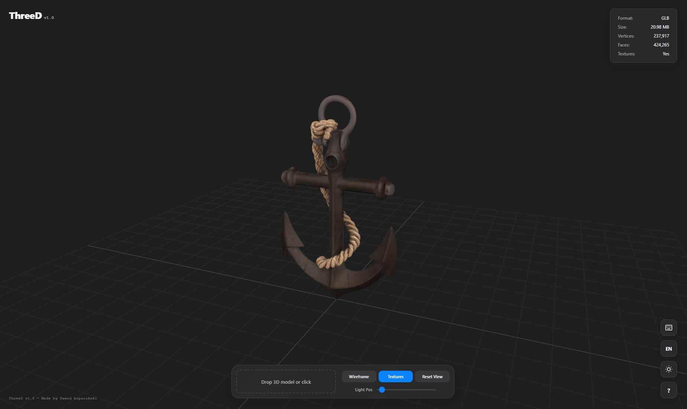

# Three D v1.0
Minimalist 3D model viewer built with Three.js. Focuses on performance, clean UI, and ease of use.

## Features
- **Drag & Drop:** Instant model loading (.glb, .gltf, .obj, .fbx, .stl).
- **Interactive UI:** Wireframe toggle, Texture toggle, and 360° light positioning.
- **Model Stats:** Real-time analysis of vertex count, face count, and file size.
- **Responsive:** Modern, hardware-inspired UI that adapts to your workflow.
- **Keymap Guide:** Built-in navigation cheat sheet.

## Navigation
- **Rotate:** Middle Mouse Button (MMB)
- **Pan:** Right Mouse Button (RMB) drag
- **Zoom:** Scroll
- **Select:** Left Mouse Button (LMB)
- **Delete:** DEL key

## Tech Stack
- [Three.js](https://threejs.org/) - 3D engine
- HTML5, CSS3, ES Modules

---
*Made by Dawid Łopaciński*
